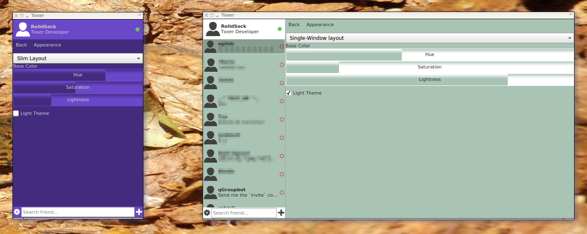

# Toxer: The Tox user interface which simply fits.

Have you always wanted a Tox user interface, that simply scales to your device(s), while at the same time looks beautiful and smooth without compromising security? This is what Toxer aims at.

This repository contains a Toxer user interface - written in the awesome QML presentation language.

## Status: **! experimental !**
**Please note our baby is just born and learning to walk!**

If you have an idea and would like to help out, feel welcome!

## Select an existing Tox profile or create a new one to start a Tox session.

## After opening a Tox profile, select a friend and chat via Tox distributed network!

## Toxer comes with two layouts and lets you select your favorite color environment!

## Resources:

* Contact:
    * **Tox protocol (a.k.a toxcore)** based questions/suggestions are answered by our competent Tox enthusiasts on IRC channels [#tox-dev](irc://irc.freenode.net/#tox-dev) and [#toktok](irc://irc.freenode.net/#toktok)
    * For feature requests on Toxer, please file an issue or [contribute](CONTRIBUTE.md).

## Downloads (binary releases)

Currently Toxer can only be built from source. If you want to help out, please contact the community as written in the [Resources](#resources) section.

# License
The Toxer user interface is freely usable under the terms of the MIT license. The licenses of the underlying libraries (e.g. Qt and toxcore) apply to these components.
